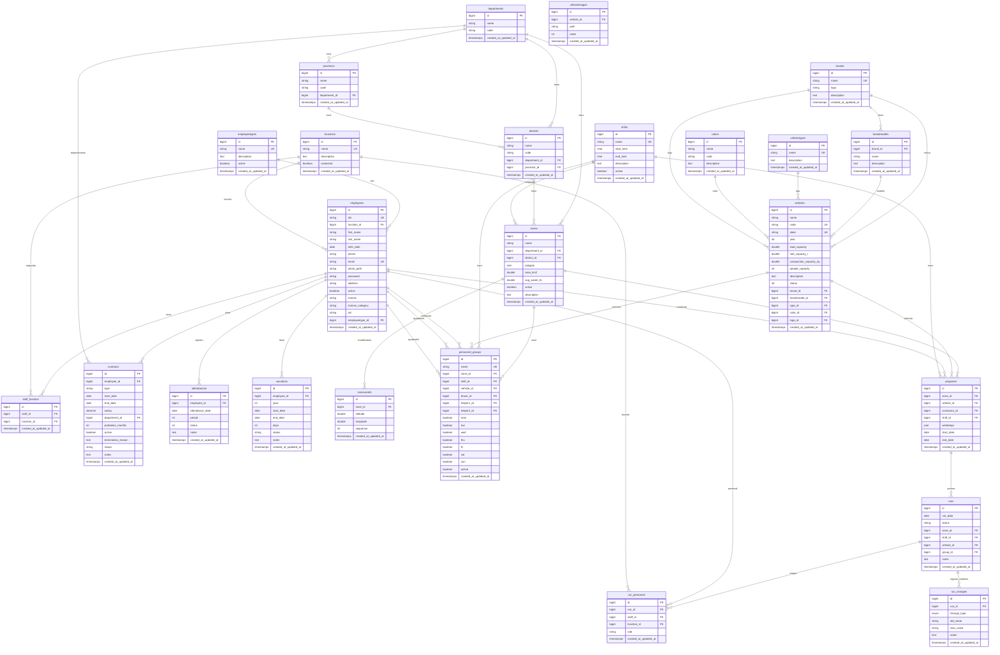

# Diagrama Entidad-Relación - Base de Datos RSU Reciclaje

```mermaid
erDiagram
    %% Catálogos de Ubicación
    departments ||--o{ provinces : "tiene"
    departments ||--o{ districts : "tiene"
    provinces ||--o{ districts : "tiene"
    departments ||--o{ zones : "tiene"
    districts ||--o{ zones : "tiene"
    
    %% Catálogos de Vehículos
    brands ||--o{ brandmodels : "tiene"
    brands ||--o{ vehicles : "marca"
    brandmodels ||--o{ vehicles : "modelo"
    vehicletypes ||--o{ vehicles : "tipo"
    colors ||--o{ vehicles : "color"
    brands ||--o{ vehicles : "logo"
    
    %% Catálogos de Personal
    employeetypes ||--o{ employees : "tipo"
    functions ||--o{ employees : "función"
    employees ||--o{ staff_function : "tiene"
    functions ||--o{ staff_function : "asignada"
    
    %% Contratos y Asistencias
    employees ||--o{ contracts : "tiene"
    departments ||--o{ contracts : "departamento"
    employees ||--o{ attendances : "registra"
    employees ||--o{ vacations : "tiene"
    
    %% Turnos y Zonas
    shifts ||--o{ zones : "asignado"
    zones ||--o{ zonecoords : "coordenadas"
    
    %% Grupos de Personal
    zones ||--o{ personnel_groups : "zona"
    shifts ||--o{ personnel_groups : "turno"
    vehicles ||--o{ personnel_groups : "vehículo"
    employees ||--o{ personnel_groups : "conductor"
    employees ||--o{ personnel_groups : "ayudante1"
    employees ||--o{ personnel_groups : "ayudante2"
    
    %% Programación
    zones ||--o{ programs : "zona"
    vehicles ||--o{ programs : "vehículo"
    employees ||--o{ programs : "conductor"
    shifts ||--o{ programs : "turno"
    programs ||--o{ runs : "genera"
    
    %% Recorridos
    runs ||--o{ run_personnel : "asigna"
    employees ||--o{ run_personnel : "personal"
    functions ||--o{ run_personnel : "función"
    runs ||--o{ run_changes : "registra_cambios"
    
    %% Tablas principales
    departments {
        bigint id PK
        string name
        string code
        timestamps created_at_updated_at
    }
    
    provinces {
        bigint id PK
        string name
        string code
        bigint department_id FK
        timestamps created_at_updated_at
    }
    
    districts {
        bigint id PK
        string name
        string code
        bigint department_id FK
        bigint province_id FK
        timestamps created_at_updated_at
    }
    
    zones {
        bigint id PK
        string name
        bigint department_id FK
        bigint district_id FK
        json polygon
        double area_km2
        double avg_waste_tb
        boolean active
        text description
        timestamps created_at_updated_at
    }
    
    zonecoords {
        bigint id PK
        bigint zone_id FK
        double latitude
        double longitude
        int sequence
        timestamps created_at_updated_at
    }
    
    brands {
        bigint id PK
        string name UK
        string logo
        text description
        timestamps created_at_updated_at
    }
    
    brandmodels {
        bigint id PK
        bigint brand_id FK
        string name
        text description
        timestamps created_at_updated_at
    }
    
    vehicletypes {
        bigint id PK
        string name UK
        text description
        timestamps created_at_updated_at
    }
    
    colors {
        bigint id PK
        string name
        string code
        text description
        timestamps created_at_updated_at
    }
    
    vehicles {
        bigint id PK
        string name
        string code UK
        string plate UK
        int year
        double load_capacity
        double fuel_capacity_l
        double compaction_capacity_kg
        int people_capacity
        text description
        int status
        bigint brand_id FK
        bigint brandmodel_id FK
        bigint type_id FK
        bigint color_id FK
        bigint logo_id FK
        timestamps created_at_updated_at
    }
    
    vehicleimages {
        bigint id PK
        bigint vehicle_id FK
        string path
        int order
        timestamps created_at_updated_at
    }
    
    employeetypes {
        bigint id PK
        string name UK
        text description
        boolean active
        timestamps created_at_updated_at
    }
    
    employees {
        bigint id PK
        string dni UK
        bigint function_id FK
        string first_name
        string last_name
        date birth_date
        string phone
        string email UK
        string photo_path
        string password
        string address
        boolean active
        string license
        string license_category
        string pin
        bigint employeetype_id FK
        timestamps created_at_updated_at
    }
    
    functions {
        bigint id PK
        string name UK
        text description
        boolean protected
        timestamps created_at_updated_at
    }
    
    staff_function {
        bigint id PK
        bigint staff_id FK
        bigint function_id FK
        timestamps created_at_updated_at
    }
    
    contracts {
        bigint id PK
        bigint employee_id FK
        string type
        date start_date
        date end_date
        decimal salary
        bigint department_id FK
        int probation_months
        boolean active
        text termination_reason
        string status
        text notes
        timestamps created_at_updated_at
    }
    
    attendances {
        bigint id PK
        bigint employee_id FK
        date attendance_date
        int period
        int status
        text notes
        timestamps created_at_updated_at
    }
    
    vacations {
        bigint id PK
        bigint employee_id FK
        int year
        date start_date
        date end_date
        int days
        string status
        text notes
        timestamps created_at_updated_at
    }
    
    shifts {
        bigint id PK
        string name UK
        time start_time
        time end_time
        text description
        boolean active
        timestamps created_at_updated_at
    }
    
    personnel_groups {
        bigint id PK
        string name UK
        bigint zone_id FK
        bigint shift_id FK
        bigint vehicle_id FK
        bigint driver_id FK
        bigint helper1_id FK
        bigint helper2_id FK
        boolean mon
        boolean tue
        boolean wed
        boolean thu
        boolean fri
        boolean sat
        boolean sun
        boolean active
        timestamps created_at_updated_at
    }
    
    programs {
        bigint id PK
        bigint zone_id FK
        bigint vehicle_id FK
        bigint conductor_id FK
        bigint shift_id FK
        json weekdays
        date start_date
        date end_date
        timestamps created_at_updated_at
    }
    
    runs {
        bigint id PK
        date run_date
        string status
        bigint zone_id FK
        bigint shift_id FK
        bigint vehicle_id FK
        bigint group_id FK
        text notes
        timestamps created_at_updated_at
    }
    
    run_personnel {
        bigint id PK
        bigint run_id FK
        bigint staff_id FK
        bigint function_id FK
        string role
        timestamps created_at_updated_at
    }
    
    run_changes {
        bigint id PK
        bigint run_id FK
        enum change_type
        string old_value
        string new_value
        text notes
        timestamps created_at_updated_at
    }
```

